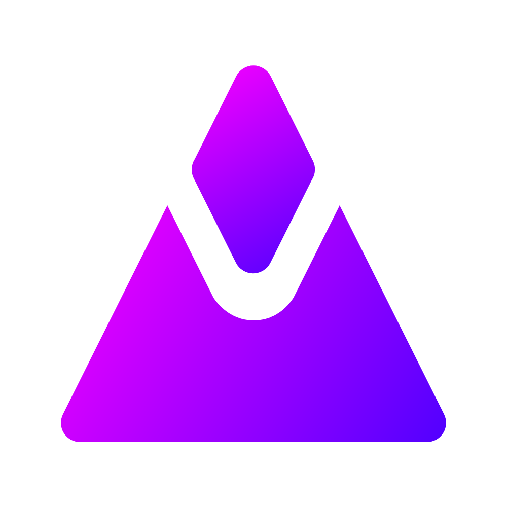

 

 

  

  <h1 align="center">LABS-Experiences</h1>

  

    Where all LABS' experiences are gathered.
     
    <a href="https://github.com/Leo-Corporation/LABS-Experiences/releases"><strong>Download »</strong></a>
     
    <a href="https://github.com/Leo-Corporation/LABS-Experiences/issues/new?assignees=&labels=bug&template=bug_report.md&title=%5BBug%5D+">Report Bug</a>
    ·
    <a href="https://github.com/Leo-Corporation/LABS-Experiences/issues/new?assignees=&labels=suggestion+enhancement&template=feature_request.md&title=%5BEnhancement%5D+">Request Feature</a>
    ·
    <a href="https://en.leocorp.fr/labs">Learn more</a>

  

## Introduction
"LABS Experiences" is a software that contains various experiences that might help implements new features in our softwares.

In this project we make tests, for example, we are making tests on [LeoCorpLibrary](https://github.com/Leo-Corporation/LeoCorpLibrary) to see if the new additions of LeoCorpLibrary works as expected. We also test new features that might be in our final products, like improving a password generation system, testing a new saving system, and much more!

## Contribute
You will also need to have the following tools:
- Microsoft Visual Studio 2019
  - .NET Desktop Developpement
- Git
- (*optionnal*) Microsoft Visual Studio Code
- .NET 5

## License
Project under the [MIT](https://github.com/Leo-Corporation/LABS-Experiences/blob/master/LICENSE.md) license.
